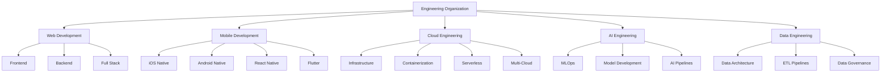

# Business Unit Standards

Comprehensive development standards and best practices for each business unit in our engineering organization.

## Business Unit Overview

## Choose Your Business Unit

### Web Development
**Technologies**: React, Vue, Angular, Node.js, Python, .NET  
**Focus Areas**: User interfaces, APIs, web applications, microservices

**Key Standards:**
- [Full Stack Development](web/fullstack.md)
- [Frontend Standards](web/frontend.md)
- [Backend Standards](web/backend.md)
- [Testing & Quality](web/testing.md)

### Mobile Development
**Technologies**: Swift, Kotlin, React Native, Flutter  
**Focus Areas**: Native apps, cross-platform solutions, mobile UX

**Key Standards:**
- [Native Development](mobile/native.md)
- [Cross-Platform Solutions](mobile/cross-platform.md)
- [Performance & UX](mobile/performance.md)

### Cloud Engineering
**Technologies**: AWS, Azure, GCP, Kubernetes, Terraform  
**Focus Areas**: Infrastructure, scalability, DevOps, security

**Key Standards:**
- [Infrastructure as Code](cloud/infrastructure.md)
- [Container Standards](cloud/containers.md)
- [Serverless Patterns](cloud/serverless.md)
- [Multi-Cloud Strategy](cloud/multi-cloud.md)

### AI Engineering
**Technologies**: Python, TensorFlow, PyTorch, MLflow, Kubeflow  
**Focus Areas**: Machine learning, model deployment, AI operations

**Key Standards:**
- [ML Operations](ai/mlops.md)
- [Model Standards](ai/models.md)
- [Data Pipeline](ai/pipelines.md)

### Data Engineering
**Technologies**: Python, Spark, Airflow, SQL, NoSQL  
**Focus Areas**: Data pipelines, analytics, data quality, governance

**Key Standards:**
- [Data Architecture](data/architecture.md)
- [Pipeline Standards](data/pipelines.md)
- [Quality & Governance](data/governance.md)

## Universal Standards

Regardless of your business unit, all teams follow these core principles:

### Code Quality
- **Clean Code**: Readable, maintainable, and self-documenting
- **Testing**: Comprehensive unit, integration, and end-to-end tests
- **Documentation**: Clear README, API docs, and code comments
- **Security**: Security-first development practices

### Development Process
- **Version Control**: Git with feature branches and pull requests
- **Code Review**: Mandatory peer review for all changes
- **Continuous Integration**: Automated testing and quality checks
- **Deployment**: Automated deployment pipelines

### Performance & Scalability
- **Performance Testing**: Regular performance benchmarking
- **Monitoring**: Comprehensive logging and metrics
- **Error Handling**: Graceful error handling and recovery
- **Scalability**: Design for horizontal scaling

### Collaboration
- **Documentation**: Keep documentation current and accessible
- **Knowledge Sharing**: Regular tech talks and learning sessions
- **Mentoring**: Support junior developers and cross-training
- **Communication**: Clear, concise technical communication

## Getting Started with Your Business Unit

### Step 1: Choose Your Path
Select the business unit that matches your role and interests.

### Step 2: Review Standards
Read through the specific standards and best practices for your unit.

### Step 3: Set Up Environment
Follow the environment setup guide for your technology stack.

### Step 4: Start Contributing
Begin with small tasks to familiarize yourself with our processes.

## Cross-Business Unit Collaboration

### Integration Points

**Web ↔ Mobile**
- Shared APIs and data models
- Consistent design systems
- Authentication and authorization

**Web/Mobile ↔ Cloud**
- Infrastructure requirements
- Deployment pipelines
- Monitoring and observability

**All Units ↔ AI**
- AI model integration
- Data requirements
- Performance optimization

**All Units ↔ Data**
- Data collection and analytics
- Reporting requirements
- Data governance compliance

### Collaboration Best Practices

1. **Regular Sync Meetings**: Cross-functional team meetings
2. **Shared Documentation**: Central knowledge base
3. **Code Sharing**: Reusable libraries and components
4. **Standards Alignment**: Consistent patterns across units

## Quality Metrics

Each business unit tracks these key metrics:

### Development Metrics
- **Code Coverage**: Minimum 80% test coverage
- **Build Success Rate**: >95% successful builds
- **Deployment Frequency**: Daily deployments to staging
- **Lead Time**: <48 hours from commit to production

### Quality Metrics
- **Bug Escape Rate**: <5% bugs reach production
- **Security Vulnerabilities**: Zero high-severity issues
- **Performance**: Meet SLA requirements
- **Uptime**: 99.9% availability

### Team Metrics
- **Code Review Time**: <24 hours average
- **Knowledge Sharing**: Monthly tech talks
- **Documentation Coverage**: All APIs documented
- **Onboarding Time**: New developers productive in 1 week

## Resources and Tools

### Development Tools
- **IDEs**: VS Code, JetBrains IDEs
- **Version Control**: Git, GitHub
- **CI/CD**: GitHub Actions, Jenkins
- **Monitoring**: Datadog, New Relic, Sentry

### Communication Tools
- **Chat**: Slack, Microsoft Teams
- **Video**: Zoom, Google Meet
- **Documentation**: Confluence, Notion
- **Project Management**: Jira, Linear

### Learning Resources
- **Internal Wiki**: Company-specific knowledge
- **Tech Talks**: Regular learning sessions
- **Conferences**: Industry conferences and workshops
- **Certification**: Encouraged professional certifications

## Support and Contact

### Technical Support
- **Team Leads**: First point of contact for technical issues
- **Architecture Team**: For system design and architecture questions
- **DevOps Team**: For infrastructure and deployment issues
- **Security Team**: For security-related questions

### Documentation Updates
Found outdated information? Help us improve:
1. Create an issue in the documentation repository
2. Submit a pull request with corrections
3. Contact the documentation maintainers

---

**Quick Navigation:**
- [Web Development →](web/index.md)
- [Mobile Development →](mobile/index.md)
- [Cloud Engineering →](cloud/index.md)
- [AI Engineering →](ai/index.md)
- [Data Engineering →](data/index.md)

**Need help choosing?** Contact your team lead or engineering manager for guidance on which business unit best fits your role and career goals.