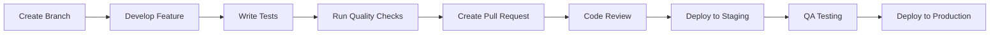

# First Steps Guide

Complete this guide to make your first contribution and understand our development workflow.

## Development Workflow Overview



## Step 1: Choose Your First Task

Select a beginner-friendly task based on your business unit:

### Web Development
- Add a new component to the design system
- Implement a simple API endpoint
- Write unit tests for existing functionality
- Update documentation

### Mobile Development
- Add a new screen with basic functionality
- Implement form validation
- Add unit tests for utility functions
- Update app icons or assets

### Cloud Engineering
- Create a new Terraform module
- Add monitoring alerts
- Update CI/CD pipeline
- Document infrastructure changes

### AI Engineering
- Create a data preprocessing script
- Add model evaluation metrics
- Implement data validation
- Update ML experiment tracking

### Data Engineering
- Create a new data transformation
- Add data quality checks
- Implement data pipeline monitoring
- Update data documentation

## Step 2: Set Up Your Development Branch

```bash
# Clone the repository
git clone https://github.com/your-org/project-name.git
cd project-name

# Create your feature branch
git checkout -b feature/your-first-task

# Install dependencies
npm install  # or yarn, pip install, etc.

# Start development environment
docker-compose up -d
npm run dev
```

## Step 3: Understand the Codebase

### Code Architecture Review

1. **Read the README.md** - Understand project purpose and setup
2. **Explore the project structure** - Follow our [structure standards](project-structure.md)
3. **Review existing code** - Look for patterns and conventions
4. **Run existing tests** - Understand test coverage and patterns

### Key Files to Review

```bash
# Configuration files
package.json          # Dependencies and scripts
.env.example          # Environment variables
docker-compose.yml    # Development services

# Source code structure
src/                  # Main source code
tests/               # Test files
docs/                # Documentation
```

## Step 4: Implement Your First Change

### Code Quality Standards

**Before writing code:**
- [ ] Understand the requirements
- [ ] Plan your approach
- [ ] Identify affected components
- [ ] Consider edge cases

**While writing code:**
- [ ] Follow naming conventions
- [ ] Add appropriate comments
- [ ] Handle errors gracefully
- [ ] Consider performance implications

**Example: Adding a Simple Component**

```typescript
// src/components/WelcomeMessage.tsx
import React from 'react';

interface WelcomeMessageProps {
  userName: string;
  isNewUser?: boolean;
}

/**
 * Displays a personalized welcome message
 * @param userName - The user's display name
 * @param isNewUser - Whether this is a new user
 */
export const WelcomeMessage: React.FC<WelcomeMessageProps> = ({ 
  userName, 
  isNewUser = false 
}) => {
  const message = isNewUser 
    ? `Welcome to our platform, ${userName}!`
    : `Welcome back, ${userName}!`;

  return (
    <div className="welcome-message">
      <h2>{message}</h2>
      {isNewUser && (
        <p>Let's get you started with a quick tour.</p>
      )}
    </div>
  );
};
```

## Step 5: Write Tests

Every change should include appropriate tests:

**Test Example:**

```typescript
// src/components/__tests__/WelcomeMessage.test.tsx
import { render, screen } from '@testing-library/react';
import { WelcomeMessage } from '../WelcomeMessage';

describe('WelcomeMessage', () => {
  it('displays welcome back message for existing users', () => {
    render(<WelcomeMessage userName="John" isNewUser={false} />);
    expect(screen.getByText('Welcome back, John!')).toBeInTheDocument();
  });

  it('displays welcome message for new users', () => {
    render(<WelcomeMessage userName="Jane" isNewUser={true} />);
    expect(screen.getByText('Welcome to our platform, Jane!')).toBeInTheDocument();
    expect(screen.getByText('Let\'s get you started with a quick tour.')).toBeInTheDocument();
  });
});
```

## Step 6: Run Quality Checks

```bash
# Run tests
npm test

# Run linter
npm run lint
npm run lint:fix

# Type checking (TypeScript)
npm run type-check

# Build verification
npm run build

# Security audit
npm audit
```

### Quality Gates Checklist

- [ ] All tests pass
- [ ] Code coverage meets minimum threshold
- [ ] No linting errors
- [ ] No type errors
- [ ] Build succeeds
- [ ] No security vulnerabilities
- [ ] Performance tests pass (if applicable)

## Step 7: Create Pull Request

### Commit Your Changes

```bash
# Add your changes
git add .

# Commit with descriptive message
git commit -m "feat: add WelcomeMessage component with new user support

- Displays personalized welcome messages
- Shows additional guidance for new users
- Includes comprehensive tests
- Follows component architecture patterns"

# Push to your branch
git push origin feature/your-first-task
```

### Pull Request Template

```markdown
## Description
Brief description of changes made.

## Type of Change
- [ ] Bug fix
- [x] New feature
- [ ] Breaking change
- [ ] Documentation update

## Testing
- [x] Unit tests added/updated
- [x] Integration tests added/updated
- [x] Manual testing completed

## Checklist
- [x] Code follows style guidelines
- [x] Self-review completed
- [x] Documentation updated
- [x] Tests added for new functionality
- [x] All tests pass

## Screenshots (if applicable)
[Add screenshots here]

## Related Issues
Closes #123
```

## Step 8: Code Review Process

### Preparing for Review

1. **Self-review your code** - Check for obvious issues
2. **Test your changes thoroughly** - Ensure everything works
3. **Update documentation** - Keep docs current
4. **Add reviewers** - Tag appropriate team members

### During Review

- **Respond promptly** to feedback
- **Ask questions** if feedback is unclear
- **Make requested changes** promptly
- **Learn from feedback** - Use it to improve

### Review Criteria

**Code Quality:**
- Readability and maintainability
- Performance considerations
- Security best practices
- Error handling

**Architecture:**
- Follows established patterns
- Proper separation of concerns
- Appropriate abstractions
- Scalability considerations

**Testing:**
- Adequate test coverage
- Edge cases handled
- Integration points tested
- Performance tests (when needed)

## Step 9: Deployment

### Staging Deployment

After PR approval:

1. **Merge to main branch** - Triggers staging deployment
2. **Monitor deployment** - Check logs and metrics
3. **Validate functionality** - Test in staging environment
4. **Performance check** - Verify no performance regression

### Production Deployment

1. **QA approval** - Staging tests pass
2. **Release preparation** - Version tagging
3. **Production deployment** - Automated or manual process
4. **Post-deployment monitoring** - Watch for issues

## Step 10: Celebrate and Learn

### After Successful Deployment

- **Celebrate your contribution** - You've made an impact!
- **Monitor metrics** - See how your change performs
- **Gather feedback** - Learn from users and team
- **Document learnings** - Share knowledge with team

### Continuous Improvement

- **Reflect on the process** - What went well? What could improve?
- **Share knowledge** - Help others learn from your experience
- **Pick your next task** - Keep contributing and growing

## Common First-Task Patterns

### Web Development Tasks

```typescript
// Simple API endpoint
app.get('/api/health', (req, res) => {
  res.json({ status: 'healthy', timestamp: new Date().toISOString() });
});

// Basic form validation
const validateEmail = (email: string): boolean => {
  const emailRegex = /^[^\s@]+@[^\s@]+\.[^\s@]+$/;
  return emailRegex.test(email);
};
```

### Mobile Development Tasks

```typescript
// Simple screen component (React Native)
const WelcomeScreen: React.FC = () => {
  return (
    <View style={styles.container}>
      <Text style={styles.title}>Welcome!</Text>
      <Button title="Get Started" onPress={() => {/* navigate */}} />
    </View>
  );
};
```

### Cloud Engineering Tasks

```hcl
# Simple Terraform resource
resource "aws_s3_bucket" "app_storage" {
  bucket = "${var.app_name}-storage-${var.environment}"
  
  tags = {
    Environment = var.environment
    Project     = var.project_name
  }
}
```

### AI/Data Engineering Tasks

```python
# Data validation function
def validate_data_quality(df: pd.DataFrame) -> Dict[str, bool]:
    checks = {
        'no_nulls': df.isnull().sum().sum() == 0,
        'valid_range': (df['value'] >= 0).all(),
        'expected_columns': set(df.columns) == {'id', 'value', 'timestamp'}
    }
    return checks
```

## Troubleshooting Common Issues

### Development Environment
- **Port conflicts**: Change port in configuration
- **Permission errors**: Check file permissions
- **Dependency issues**: Clear cache and reinstall

### Testing Issues
- **Tests not running**: Check test configuration
- **Coverage too low**: Add more comprehensive tests
- **Flaky tests**: Make tests more deterministic

### Code Review Feedback
- **"Too complex"**: Break into smaller functions
- **"Missing tests"**: Add unit and integration tests
- **"Performance concern"**: Profile and optimize

## Next Steps

After completing your first task:

1. **Review business unit standards** - Dive deeper into your specialization
2. **Take on larger tasks** - Gradually increase complexity
3. **Mentor others** - Help new team members
4. **Contribute to architecture** - Participate in design decisions

## Resources and Support

- **Team Documentation**: [Business Unit Guidelines](../developer-guide/index.md)
- **Architecture Guides**: [Solutions Architecture](../solutions-architect/index.md)
- **Troubleshooting**: [Operations Guide](../operations/troubleshooting.md)
- **FAQ**: [Frequently Asked Questions](../reference/faq.md)

**Need Help?**
- Ask your team lead or mentor
- Post in team Slack channels
- Schedule pair programming sessions
- Attend office hours or team meetings

Congratulations on taking your first steps! You're now ready to contribute effectively to our engineering organization.