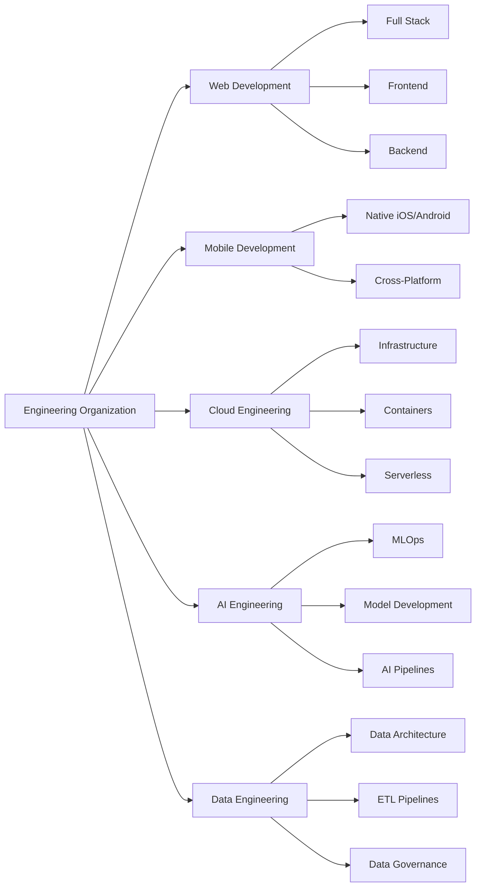

# Engineering Standards Guide

Welcome to the comprehensive engineering standards and best practices guide for our organization. This documentation serves as the definitive resource for developers, engineers, and solutions architects across all business units.

## Business Units Overview

## Quick Navigation

### By Experience Level

=== "New Team Members"
    Start with our [Getting Started Guide](getting-started/index.md) to understand our development culture, tools, and processes.
    
    **Essential Reading:**
    - [Development Environment Setup](getting-started/development-environment.md)
    - [Project Structure Standards](getting-started/project-structure.md)
    - [First Steps Guide](getting-started/first-steps.md)

=== "Developers"
    Dive into business unit-specific standards and best practices.
    
    **Choose Your Focus:**
    - [Web Development Standards](developer-guide/web/index.md)
    - [Mobile Development Standards](developer-guide/mobile/index.md)
    - [Cloud Engineering Standards](developer-guide/cloud/index.md)
    - [AI Engineering Standards](developer-guide/ai/index.md)
    - [Data Engineering Standards](developer-guide/data/index.md)

=== "Solutions Architects"
    Explore high-level architectural patterns and system design principles.
    
    **Key Resources:**
    - [Design Patterns](solutions-architect/design-patterns.md)
    - [System Integration](solutions-architect/integration.md)
    - [Performance & Scalability](solutions-architect/performance.md)
    - [Monitoring & Observability](solutions-architect/monitoring.md)

=== "Operations Teams"
    Access deployment procedures and operational guidelines.
    
    **Essential Operations:**
    - [Deployment Procedures](operations/deployment.md)
    - [System Maintenance](operations/maintenance.md)
    - [Backup & Recovery](operations/backup-recovery.md)
    - [Troubleshooting Guide](operations/troubleshooting.md)

## Core Engineering Principles

!!! tip "Our Engineering Philosophy"
    We build reliable, scalable, and maintainable systems that deliver exceptional value to our users while fostering a culture of continuous learning and innovation.

### Technical Excellence
- **Code Quality**: Write clean, readable, and well-documented code
- **Testing First**: Comprehensive testing strategies at all levels
- **Security by Design**: Integrate security considerations from the start
- **Performance Awareness**: Build with scalability and performance in mind

### Collaboration & Communication
- **Cross-Functional Teams**: Foster collaboration across business units
- **Knowledge Sharing**: Document decisions and share learnings
- **Mentorship**: Support team members' growth and development
- **Continuous Improvement**: Regular retrospectives and process refinement

### Innovation & Learning
- **Technology Evaluation**: Stay current with industry trends
- **Experimentation**: Encourage proof-of-concepts and innovation
- **Best Practices**: Learn from successes and failures
- **Skill Development**: Invest in team capabilities and expertise

## Business Unit Standards

<h3>Web Development</h3>

Comprehensive standards for full-stack, frontend, and backend development including frameworks, testing strategies, and performance optimization.

<a href="developer-guide/web/index.md">Explore Web Standards →</a>

<h3>Mobile Development</h3>

Guidelines for native iOS/Android development and cross-platform solutions with focus on user experience and performance.

<a href="developer-guide/mobile/index.md">Explore Mobile Standards →</a>

<h3>Cloud Engineering</h3>

Infrastructure as Code, containerization, serverless architectures, and multi-cloud strategies for scalable systems.

<a href="developer-guide/cloud/index.md">Explore Cloud Standards →</a>

<h3>AI Engineering</h3>

MLOps practices, model development standards, and AI pipeline architecture for production-ready AI systems.

<a href="developer-guide/ai/index.md">Explore AI Standards →</a>

<h3>Data Engineering</h3>

Data architecture patterns, pipeline standards, and governance frameworks for reliable data systems.

<a href="developer-guide/data/index.md">Explore Data Standards →</a>

## Getting Started

1. **New to the organization?** Start with our [Getting Started Guide](getting-started/index.md)
2. **Need specific standards?** Navigate to your [Business Unit Standards](developer-guide/index.md)
3. **Working on architecture?** Check our [Solutions Architecture](solutions-architect/index.md) section
4. **Have questions?** Visit our [FAQ](reference/faq.md) or [Contributing Guide](reference/contributing.md)

## Quick Links

- [Architecture Overview](architecture/index.md)
- [Glossary](reference/glossary.md)
- [Changelog](reference/changelog.md)
- [Resources](reference/resources.md)

---

**Last Updated**: {{ git_revision_date_localized }}  
**Maintained by**: Engineering Leadership Team  
**Questions?** [Open an issue](https://github.com/rcdelacruz/engineering-standards-guide/issues) or reach out to the engineering team.
